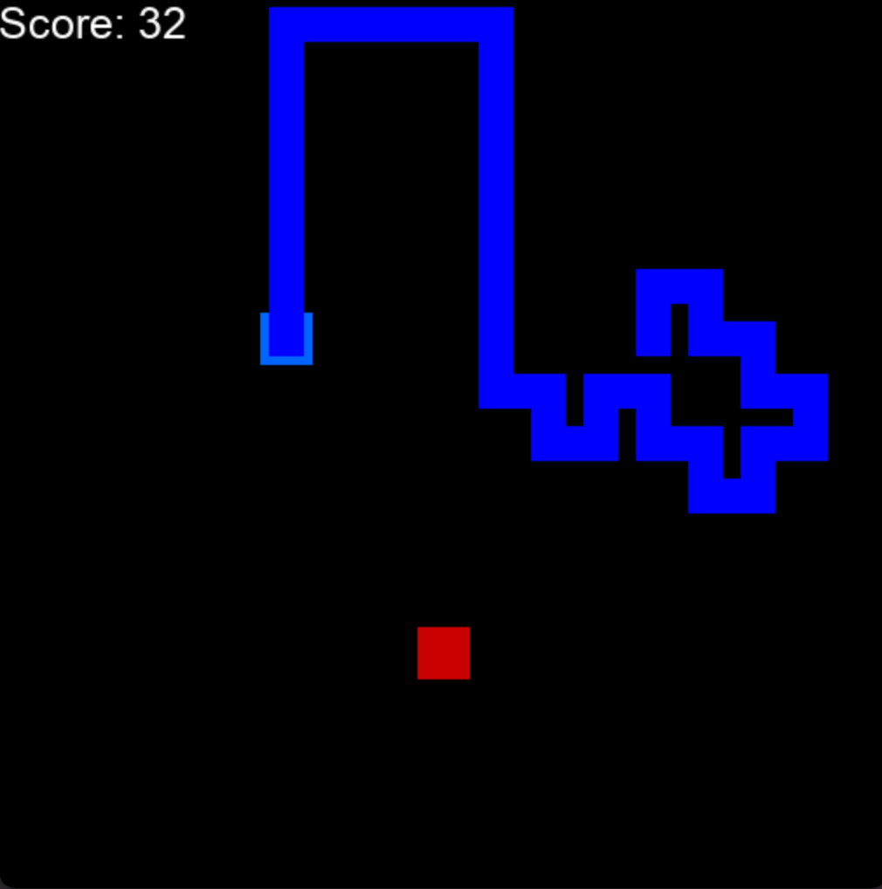
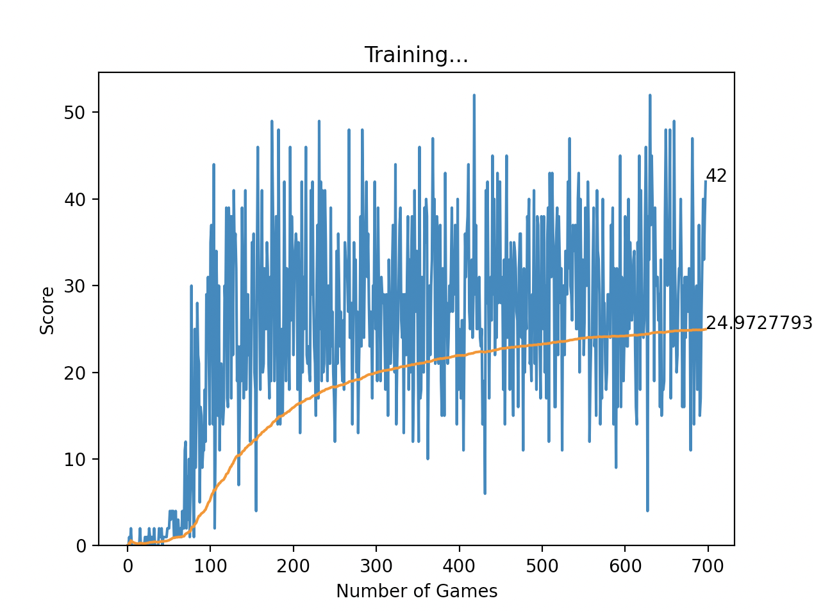

# snake-learning-ai
This AI uses Pytorch to learn how to play the snake game.

## Network
- The network is a Deep Q-Learning Network (DQN).
- Inputs:
	- A vision cone around our snake's head extending out in a line in all 8 directions. For each point, we input a boolean of whether or not that point is a collision or would be open.
	- Four booleans of whether the food is above, below, left or right of the head of the snake.
- Output:
	- A number representing left right or straight.
- Rewards:
	- +10: for getting a food.
	- +100: for winning.
	- -15: for losing.
	- -0.01: per play step (to encourage the snake to progress instead of stalling)

## Game
- This is a 17x17 snake board. 
- The snake grows when it eats an apple and dies when it hits either a wall or itself.

	

## Usage
- To use the agent, run `agent.py`. 
- The play snake yourself, run `human_snake.py`.
- To change the speed, rewards, block size, and board size, use `snake.py`.
- To change the graph you get, use `helper.py`.

	

- To change the physical network, use `model.py`.
- To change the batch size, learning rate, and vision range `agent.py`.
